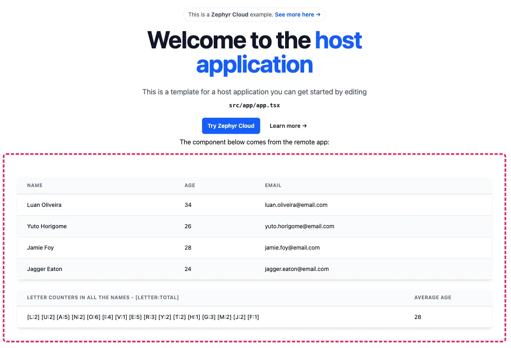

# Valor Interview Challenge

This project features:

- Rspack;
- Module Federation;
- React;
- Tailwind;
- Typescript

This is a challenge to showcase one's ability to debug issues around the bundling process, styling configuration, federated applications, TypeScript, among some other things.

There are several problems with this repository which the candidate must debug, research and resolve.

## Getting started

Install the dependencies if they are not installed yet:

```bash
pnpm i
```

And run the host application:

```bash
pnpm --filter host run dev
```

And run the remote application:

```bash
pnpm --filter remote run dev
```

The complete resolution of the host application must look something like this:



Good luck!
